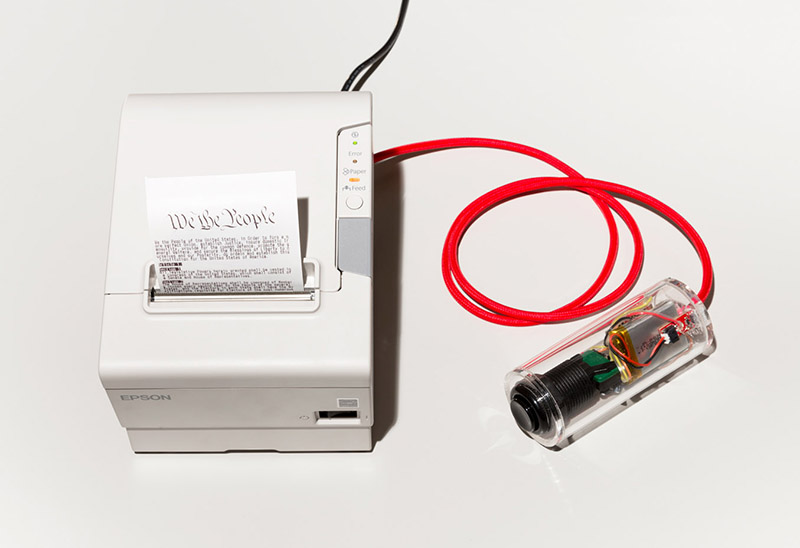

*These are the source files for CONSTI2GO, the repo is not complete yet, electronic schematics to come. The original project runs the Arduino code on a Teensy 3.1 board, which has enough ROM to store the full text.*

# CONSTI2GO

Thibault Brevet, _CONSTI2GO_, 2014. [view on Vimeo.](https://vimeo.com/88304676)

Hijacking the existing network of standard receipt printers, CONSTI2GO is a portable device that allows, on the press of a button, to print copies of the US Constitution.

Commissioned by Jeff Goldenson at Harvard Library Innovation Lab for LABRARY.bike

The project was shown during SXSW Interactive 2014 and is currently shown as part of the Art in Embassies Program at the US Embassy in Bern, CH.
[Press images here](ow.ly/uooww). Photo credits: Julien Gremaud.